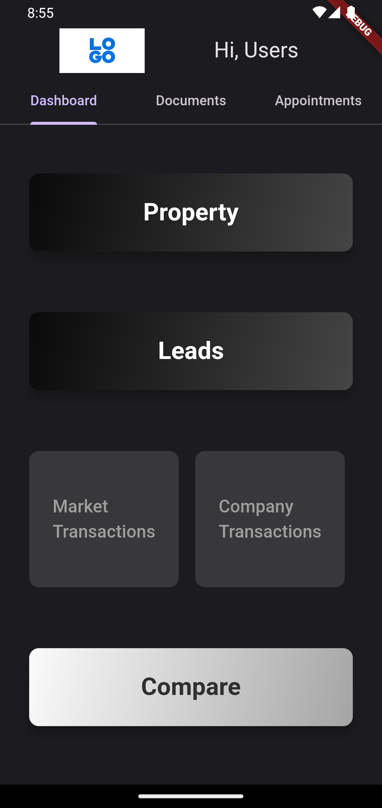
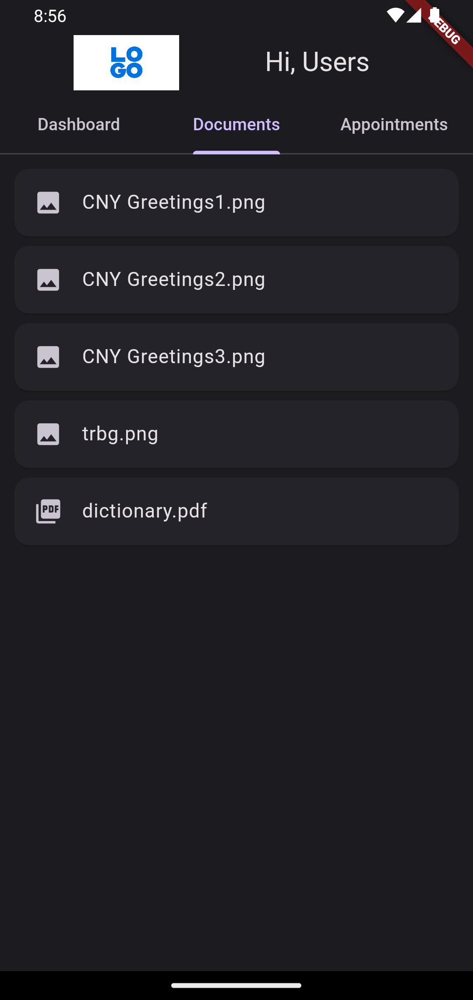
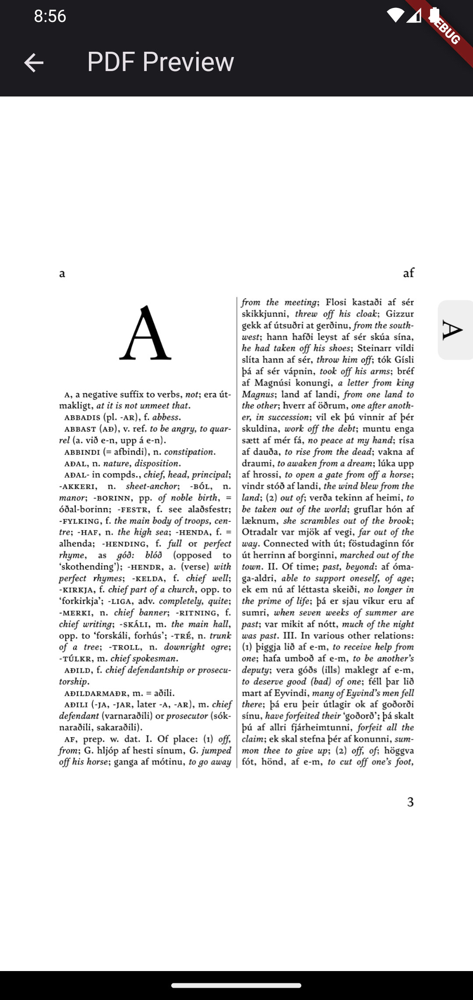
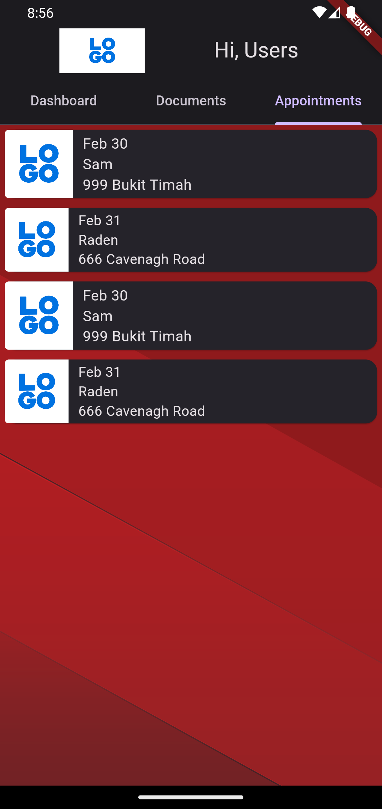

# Flutter CRM System

A simple yet structured Customer Relationship Management (CRM) system developed with Flutter. This project demonstrates the power and flexibility of Flutter for building complex applications. The CRM system is designed to manage and analyze customer interactions and data throughout the customer lifecycle, with the goal of improving business relationships with customers, assisting in customer retention, and driving sales growth.

## Features

- **Customer Management:** Easily add, edit, and manage customer profiles to keep track of customer interactions and data.
- **Document Handling:** Utilize `flutter_pdfview` and `path_provider` packages for managing and viewing documents within the app.
- **Data Visualization:** Analyze customer data through intuitive graphs and charts.
- **Cross-Platform:** Developed using Flutter, making it compatible with both Android and iOS devices without compromising performance or experience.

## Packages Used

- `flutter_pdfview`: For rendering PDF documents within the app.
- `path_provider`: For finding commonly used locations on the filesystem to store and retrieve user-generated documents.

## Screenshots

Here are some glimpses of what this CRM system looks like:

